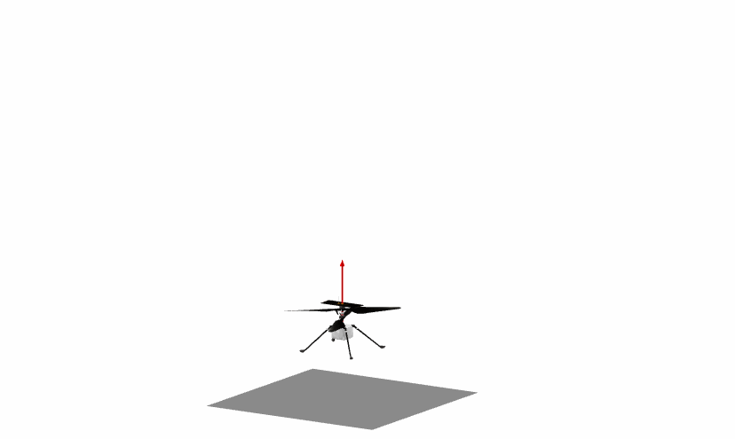

Ingenuity
=====

This is a model of the Ingenuity helicopter.

Prerequisites
-------
The model package is based on **Vehicle Dynamics Library** and **Electrification Library** from Modelon. All prerequisites are included in an installation of **Modelon Impact Pro**. The models can also be used in Dymola with separate installations of the required libraries, though the visualizers (glb files) are not supported.

Quick start
--------

In Ingenuity.Experiments there are six example experiments that can be simulated out of the box:
 - **ConstantThrust** - Constant thrust achieved by using Linear thrust force model
 - **Yaw** - Yaw motion achieved using a torque differential between the two rotors
 - **Hover** - Hovering motion at a constant altitude using AltitudeVelocityAnglesController and LinearPitchRoll thrust force model
 - **HoverRollPitch** - Roll and pitch motion at a constant altitude using AltitudeVelocityAnglesController and LinearPitchRoll thrust force model
 - **HoverVelocity** - Lateral and longitudinal velocity inputs at a constant altitude using AltitudeVelocityAnglesController and LinearPitchRoll thrust force model
 - **HoverPosition** - Lateral, longitudinal positon, altitude controller using AltitudePositionAnglesController and LinearPitchRoll thrust force model

Acknowledgements
-----------
The visualization elements are extracted from https://mars.nasa.gov/resources/25043/mars-ingenuity-helicopter-3d-model/. This is also where the main geometrical parameters are gathered.
