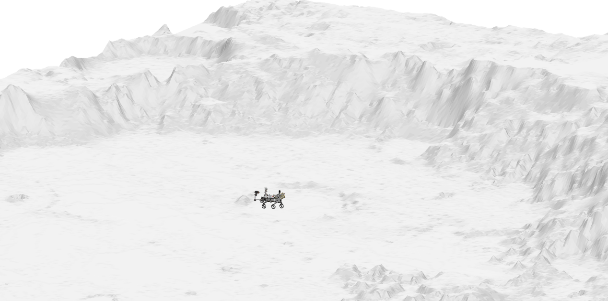
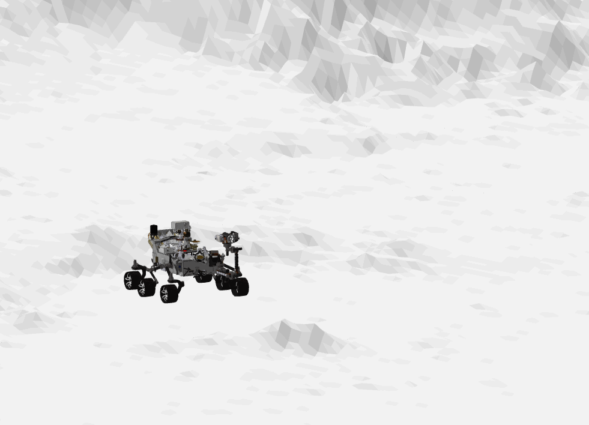

Perseverance
============

This is a model of NASA's Perseverance rover.

Prerequisites
-------------
The model package is based on **[Vehicle Dynamics Library](https://modelon.com/library/vehicle-dynamics-library/)** and **[Electrification Library](https://modelon.com/library/electrification-library/)** from Modelon. All prerequisites are included in an installation of **Modelon Impact Pro**. The models can also be used in Dymola with separate installations of the required libraries, though the visualizers (glb files) are not supported.

Experiments
-----------
The [Perseverance.Experiments](./Experiments) directory contains six example experiments that can be simulated out of the box:

 - **[FlatPad](./Experiments/FlatPad.mo)** - Standing still on flat ground
 - **[DrivingFlat](./Experiments/DrivingFlat.mo)** - Driving forward on flat ground at a constant speed
 - **[DrivingCleats](./Experiments/DrivingCleats.mo)** - Driving over a rectangular cleat at a constant speed
 - **[Spin](./Experiments/Spin.mo)** - Spin in place by driving wheels on each side in opposite directions and adding the appropriate steering angles to the corner wheels
 - **[DrivingUneven](./Experiments/DrivingUneven.mo)** - Driving forward over uneven ground generated using the Spirit_landing_site 3D model
 - **[DrivingUneven2](./Experiments/DrivingUneven2.mo)** - Driving forward over uneven ground generated using the M2020 ZCAM -- Hogwallow Flats, Sol 461 3D model

Acknowledgements
----------------
The visualization elements are extracted from https://github.com/nasa/NASA-3D-Resources/tree/master/3D%20Models/perseverance-GLB. This is also where the main geometrical parameters are gathered.

The visualizer `Perseverance/Resources/Spirit_landing_site.glb` is extracted from https://github.com/nasa/NASA-3D-Resources/tree/master/3D%20Models/Spirit%20Landing%20Site. This is also used to generate the VDL ground model data used in **[DrivingUneven](./Perseverance/Experiments/DrivingUneven.mo)**.

"M2020 ZCAM -- Hogwallow Flats, Sol 461" (https://skfb.ly/ovp6s) by Mastcam-Z is licensed under Creative Commons Attribution (http://creativecommons.org/licenses/by/4.0/).
