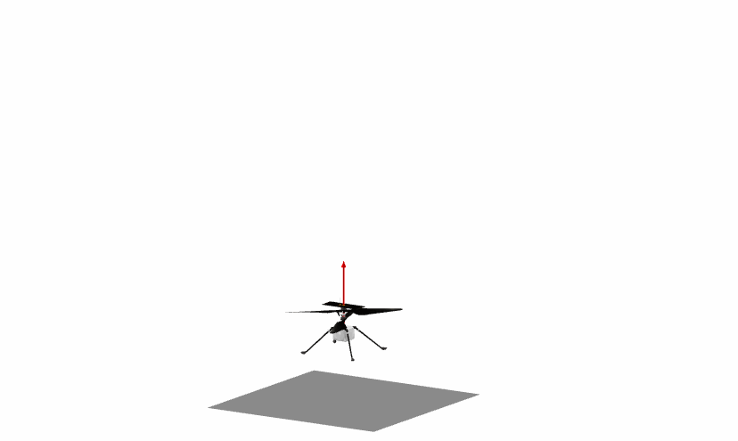

Perseverance
=====

This is a model of the Perseverance rover.

Prerequisites
-------
The model package is based on **Vehicle Dynamics Library** and **Electrification Library** from Modelon. All prerequisites are included in an installation of **Modelon Impact Pro**. The models can also be used in Dymola with separate installations of the required libraries, though the visualizers (glb files) are not supported.

Quick start
--------

In Perseverance.Experiments there are six example experiments that can be simulated out of the box:
 - **FlatPad** - Standing still on flat ground
 - **DrivingFlat** - Driving forward on flat ground at a constant speed
 - **DrivingCleats** - Driving over a rectangular cleat at a constant speed
 - **Spin** - Spin in place by driving wheels on each side in opposite directions and adding the appropriate steering angles to the corner wheels
 - **DrivingUneven** - Driving forward over uneven ground generated using the Spirit_landing_site 3D model
 - **DrivingUneven2** - Driving forward over uneven ground generated using the M2020 ZCAM -- Hogwallow Flats, Sol 461 3D model

Acknowledgements
-----------
The visualization elements are extracted from https://github.com/nasa/NASA-3D-Resources/tree/master/3D%20Models/perseverance-GLB. This is also where the main geometrical parameters are gathered.

The visualizer Perseverance/Resources/Spirit_landing_site.glb  is extracted from https://github.com/nasa/NASA-3D-Resources/tree/master/3D%20Models/Spirit%20Landing%20Site. This is also used to generate the VDL ground model data used in Perseverance.Experiments.DrivingUneven.

"M2020 ZCAM -- Hogwallow Flats, Sol 461" (https://skfb.ly/ovp6s) by Mastcam-Z is licensed under Creative Commons Attribution (http://creativecommons.org/licenses/by/4.0/).

Ingenuity
=====

This is a model of the Ingenuity helicopter.

Prerequisites
-------
The model package is based on **Vehicle Dynamics Library** and **Electrification Library** from Modelon. All prerequisites are included in an installation of **Modelon Impact Pro**. The models can also be used in Dymola with separate installations of the required libraries, though the visualizers (glb files) are not supported.

Quick start
--------

In Ingenuity.Experiments there are six example experiments that can be simulated out of the box:
 - **ConstantThrust** - Constant thrust achieved by using Linear thrust force model
 - **Yaw** - Yaw motion achieved using a torque differential between the two rotors
 - **Hover** - Hovering motion at a constant altitude using AltitudeVelocityAnglesController and LinearPitchRoll thrust force model
 - **HoverRollPitch** - Roll and pitch motion at a constant altitude using AltitudeVelocityAnglesController and LinearPitchRoll thrust force model
 - **HoverVelocity** - Lateral and longitudinal velocity inputs at a constant altitude using AltitudeVelocityAnglesController and LinearPitchRoll thrust force model
 - **HoverPosition** - Lateral, longitudinal positon, altitude controller using AltitudePositionAnglesController and LinearPitchRoll thrust force model

Acknowledgements
-----------
The visualization elements are extracted from https://mars.nasa.gov/resources/25043/mars-ingenuity-helicopter-3d-model/. This is also where the main geometrical parameters are gathered.

ExampleModels
=====

This package contains experiments showing how both the Perseverance and Ingenuity models can be simulated together.

