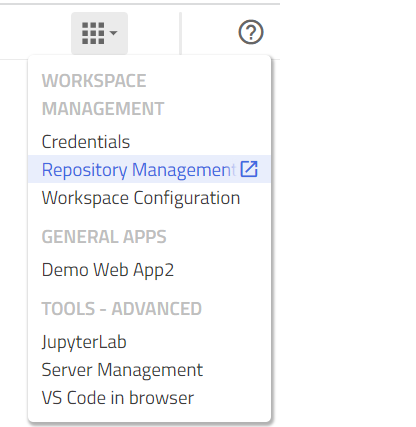
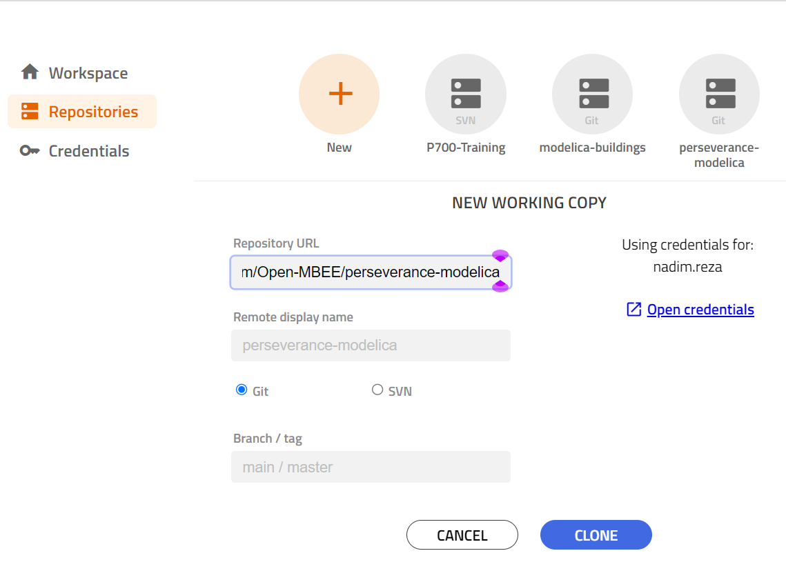
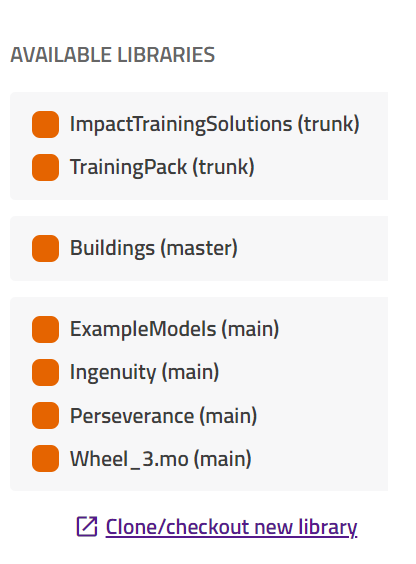
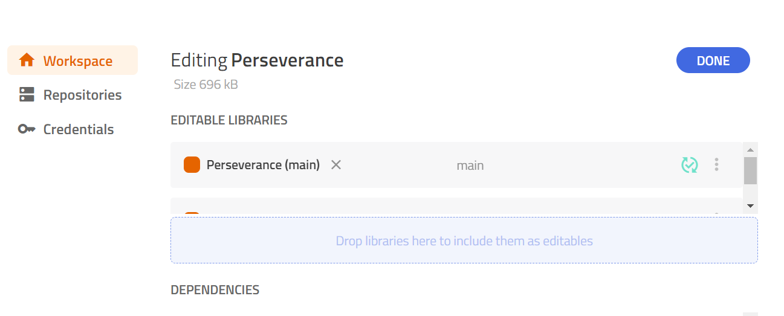

Perseverance Modelica
=====================

This repository contains Modelon experiments for NASA's Perseverance and Ingenuity platforms.

# Experiments

* [Perseverance](Perseverance/README.md); model of the Perseverance rover.
* [Ingenuity](Ingenuity/README.md); model of the Ingenuity helicopter.
* [Example Models](ExampleModels/README.md); experiments showing how both the Perseverance and Ingenuity models can be simulated together.

# Compatibility with Modelon Impact Versions

| Github Branch                                                                              | Modelon Impact Version |
|--------------------------------------------------------------------------------------------|------------------------|
| [vdl-4.1](https://github.com/Open-MBEE/perseverance-modelica/tree/vdl-4.1)                 | 1.8.0                  |
| [vdl-4-2-upgrade](https://github.com/Open-MBEE/perseverance-modelica/tree/vdl-4-2-upgrade) | ?                      |
| [vdl-4-3-upgrade](https://github.com/Open-MBEE/perseverance-modelica/tree/vdl-4-3-upgrade) | ?                      |

# Getting Started

Once logged into Modelon Impact Pro...

1. Select **Repository Management** from the Apps menu.

1. Select **New**
	1. **Repository URL**; paste **https://github.com/Open-MBEE/perseverance-modelica**
	1. Select **Git**
	1. Consult the [Compatibility with Modelon Impact Versions](#Compatibility-with-Modelon-Impact-Versions) if you are using an older version of Modelon Impact.
	1. Select **CLONE** - N.B. You need to configure your credentials before cloning a repository.

1. Once cloned, the repository will display in the list of repositories.
1. Click on **Workspace** above Repositories. If any workspace is open, the workspace name will show up. Click on 'Edit' and you'll see the `Perseverance` on the list of available libraries.

1. Drag `Perseverance` on to the blue section under **EDITABLE LIBRARIES**.

1. Select **Done** and go back to your Modelon Impact tab.
1. Reload or refresh the page and you'll see the newly added repository on the left side panel.

# License

Licensed permissively under the [Apache License v2.0](https://apache.org/licenses/LICENSE-2.0) a copy of which ships with this codebase.

# Support

Please [open an issue](https://github.com/Open-MBEE/perseverance-modelica/issues).